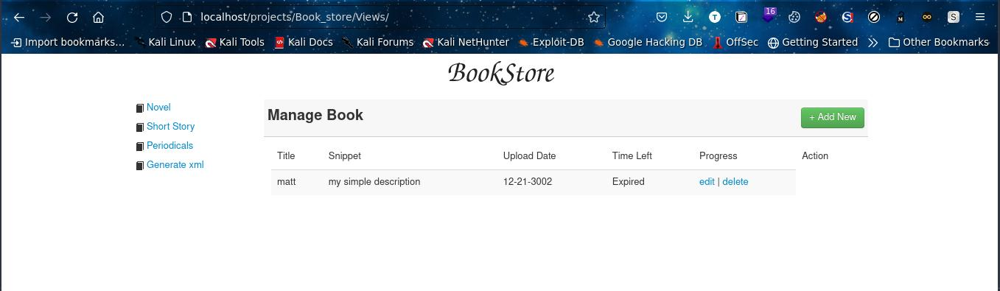

# BOOKSTORE

- 
- Welcome to my small study website .. Expect a laravel version of this soon :) 
- Its a Book store website . To see how it is you can install xampp which is easier but there is also another way.
[]* Note i will show the ways i use ,which means i wont explore all ways or many :(

## Using Xampp
- In linux do this to start xampp server .
``` sudo /opt/lampp/xampp start ```
- Visit this url , ``` http://localhost/Bookstore/Views/login.php```
- Check logs here ``` /opt/lampp/logs ```
- You must make sure this project is in this path :
``` /opt/lampp/htdocs/ ```

[]* For windows its easier ,search in program files for xampp, fire it up and everything is just procedural from there. Also makesure the project is in xampp folder inside htdocs folder . Its been a minute since i did this in windows but you can just research in case it doesn't work for you :(
 
## Setting up a Simple PHP Server
- To start a php deployment server do this:
* its same whether you are on a windows machine or linux
``` php -S localhost:80 ```
Awesome .With this the logs are displayed on the terminal , i personally like this when am doing some debugging .
- Note * You may need to start your respective mysql service!
- Maybe using this - ``` /opt/lampp/xampp startmysql```
- Or - ``` service mysql start ```

## Disclaimmer
 - Its Not Commercial .
- Why ? there maybe possible blind sql injections as the code is poorly written and other vulnerabilities too :( . Am just learning , use it to learn too :)